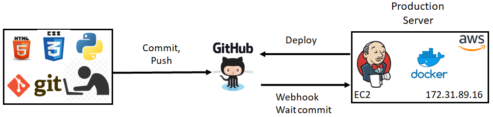

# DevOps_final_project
This is my final project for the course DevOps_online_Kharkiv_2022Q1Q2

**Objective:** learn how to automate the build process and deployment of the project and try to implement this knowledge on the example of a small web application.

**INFRASTRUCTURE OF PROJECT**

**PROJECT STEPS:**
* Setting up Git on local machine and connecting it to GitHub Repository.
* Creating Dockerfile for our application.
* Setting up Jenkins and configuring Jenkins’ plugins on AWS instance.
* Connecting Jenkins and GitHub via Webhook.
* Configuring the Build actions in Jenkins.
